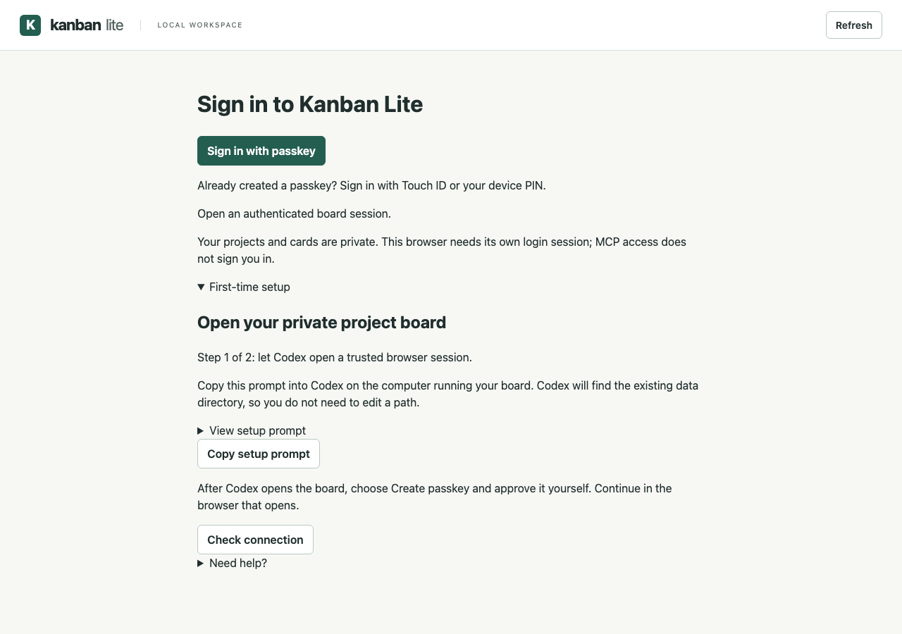

# Kanban Lite

[](https://www.npmjs.com/package/@alvintayzhenwei/kanban-lite)

[](https://github.com/alvintayzhenwei/kanban-lite/actions/workflows/ci.yml)

[](https://github.com/alvintayzhenwei/kanban-lite/actions/workflows/security.yml)
[](https://github.com/alvintayzhenwei/kanban-lite/blob/main/LICENSE)

A local Kanban board for developers and coding agents working across multiple repositories. Keep cards, blockers, artifact links, and verification evidence in one place, with a browser interface and optional Claude Code/Codex tools.

Runs on your machine with SQLite storage and built-in SQLite and HTTP APIs. No Docker, external database, cloud account, or model API is required.

## What you can do

- Organize multiple repositories into projects with priorities, owners, blockers, and WIP warnings.
- Track cards through Backlog, Ready, In Progress, Review, and Done, with a separate development phase.
- Attach plans, reviews, and test evidence. Material edits invalidate old evidence; failed completed work returns to Review.
- Work across browser tabs with revision conflicts, activity history, and SQLite backups.
- Connect optional MCP tools and generated plugins for Claude Code and Codex. OpenSpec import remains planned.


## Copy-paste setup with Codex or Claude

Use the [setup prompts](docs/setup-prompts.md) to install, start, and verify the local board with either assistant. The guide also covers manual tracking alongside Agent Skills, Superpowers, and OpenSpec.

## Run with npm / npx

Published on npm as `@alvintayzhenwei/kanban-lite`; the unscoped `kanban-lite` package is a different project. The version badge above shows the latest published release.

Use Node.js **24.21.0 or a newer Node 24 patch** (Node 25+ is not supported).

```sh
npx --yes @alvintayzhenwei/kanban-lite start --open
```

`npx` runs the package without installing a permanent command on your PATH. For a permanent installation:

```sh
npm install --global @alvintayzhenwei/kanban-lite
kanban-lite start --open
```

For reproducible runs, append an explicit published version to the package name. See the [publishing guide](docs/publishing.md) for the GitHub tag → checks → trusted npm publishing workflow and first-release setup.

## Start locally

Use Node.js **24.21.0 or a newer Node 24 patch**. Development and CI pin 24.21.0.

```sh
git clone https://github.com/alvintayzhenwei/kanban-lite.git
cd kanban-lite
npm ci
npm run build
npm start -- --open
```

The service binds to `127.0.0.1:4317`. `--open` opens your default browser with a one-time session link, then removes the credential from the address bar. The terminal prints a plain URL without credentials. Login links expire after five minutes; browser sessions last eight hours. Tabs in the same browser share a session; Chrome and Codex's browser need separate logins. Stop the service with Ctrl+C.

Open the board through the running service at `http://localhost:4317/`. Do not open `public/index.html` as a `file://` page: the application needs the service's API and browser session.

### Browser login and first-time setup

Open `http://localhost:4317/` in the browser you want to use. Returning users
choose **Sign in with passkey**. For first-time setup:

1. Expand **First-time setup** and choose **Copy setup prompt**.
2. Paste the prompt into Codex on the computer running the board. It asks Codex
   to verify the existing service, data directory, and installed CLI, then open
   a trusted browser session. You do not need to edit a placeholder path.
3. Continue in the browser that opens. Choose **Create passkey**, select your
   credential manager, and approve with Touch ID or your device PIN.
4. After the success message, use the board. Future sign-ins use your passkey.

**Do this later** lets you use the authenticated board without enrolling yet.
**Check connection** checks the current browser's session; it cannot sign in a
separate browser. **Need help?** contains CLI recovery and key-storage details.



For manual setup or recovery, run the following on the board host with the
same data directory used by the running service and MCP adapter:

```sh
kanban-lite open --data-dir /path/to/your/kanban-data
```

For a source checkout, use `node dist/src/cli.js open` instead of `kanban-lite open`.
For an npx installation, use `npx --yes @alvintayzhenwei/kanban-lite open`.
On macOS, append `--browser "Google Chrome"` to choose Chrome. Omit `--data-dir`
only when the board uses the default `~/.kanban-lite/`.

The `open` command was introduced in `0.2.0`; `0.1.1` does not include it.
Passkeys and guided onboarding are currently **Unreleased** on this branch.
The latest npm package may not include them; use this branch's built source
until a containing release is published. See [CHANGELOG.md](CHANGELOG.md).

The command opens a fresh browser session without restarting the service or
signing out other browsers. Opening the plain URL does not authenticate you.
MCP access is separate from browser login. After upgrading service code, rebuild
and restart once; subsequent browser logins need no restart.

To use another port or data directory:

```sh
npm start -- --open --port 4320 --data-dir /path/to/kanban-data
```

Register repository roots with **Add project**, then create cards. Select one project or view all projects. Repository registration supports Git worktrees and paths containing spaces.

## Agent tools and plugins

Use the [MCP setup guide](docs/mcp-setup.md) to build the optional adapter and install either host package. Ten tools inspect projects/cards and record authorized card changes, blockers, artifacts, and actual verification evidence. Both adapters connect to the same explicit board service. The shared workflow skill preserves repository and installed workflow approval gates.

Codex tool discovery and a read-only operation have been verified locally. Installed Claude Code acceptance remains pending; see [Release 2 acceptance](docs/release-2-acceptance.md) for evidence and limits.

For an existing service, rebuild and restart it before using the new agent endpoint. Plugin loading does not start the service. Use the same data directory for the browser and adapters.

## Track development without replacing it

- Move cards between Backlog, Ready, In Progress, Review, and Done. Keyboard-accessible move controls accompany drag and drop.
- Track SDLC phase separately: Discovery, Design, Planning, Implementation, Review, or Verification.
- Attach repository-relative spec, plan, or review paths. Artifact links are metadata in this release; the app does not read or rewrite those files.
- Record verification evidence before moving to Done. Material edits invalidate previous evidence; a later failed result supersedes earlier success. Changed or failed completed work returns to Review.
- Use an explicit completion override with a reason for manually accepted work. Browser-session access is not proof of human identity.
- Keep Agent Skills and Superpowers approval rules in their respective workflows. Card movements and artifact existence do not establish design approval, merge approval, deployment, or release acceptance.

Both tabs editing the same item receive revision conflicts instead of silently overwriting changes. Reload the card, then reapply edits you still need. Changes made elsewhere appear when you click **Refresh**; there is no idle polling or repository scan.

## Storage and recovery

Default state lives in `~/.kanban-lite/`, outside repositories and plugin caches. The directory contains `board.sqlite`, a private local credential, and an active service lock. Do not commit or share the credential or session links.

Create a backup while the service runs or while it is stopped. For source installs, replace the `npx` package invocation with `node dist/src/cli.js`:

```sh
npx --yes @alvintayzhenwei/kanban-lite backup --output /path/to/new-backup.sqlite
```

Existing output files are refused. Backups include cards, evidence, registered paths, and history; protect them as project data. Use the same `--data-dir` argument if you started with a custom directory.

Stop the service before restoring:

```sh
npx --yes @alvintayzhenwei/kanban-lite restore --input /path/to/backup.sqlite
```

Restore validates schema and database integrity, preserves existing state in a `pre-restore-*.sqlite` backup, and replaces the database atomically. Do not copy the live database manually. Port conflicts and active writer locks produce diagnostics instead of starting another writer. If an interrupted startup leaves `service.acquire`, ensure no Kanban startup or recovery process is running before removing that guard directory; automatic guard reclamation is deliberately avoided.

## Lightweight by design

SQLite and HTTP use Node's built-in APIs. Passkey verification and browser ceremonies use pinned SimpleWebAuthn runtime libraries; the browser helper is served locally. The optional MCP adapter has separate locked SDK/schema dependencies; they are not required for the browser board. Development dependencies provide compilation, linting, formatting, and browser tests and are not needed to run the built application. Node 24 SQLite API maturity may vary by patch; this project verifies the pinned patch.

Observed startup, memory, and package measurements are recorded in [Release 1 acceptance](docs/release-1-acceptance.md). These measurements characterize one machine, not universal performance guarantees.

## Checks and dependency updates

```sh
npm run check
npx playwright install chromium
npm run test:browser
npm run format:check
```

CI runs lint, type checks, application tests, MCP contracts, plugin installation checks, package installation/startup checks, and Chromium acceptance. Actions are pinned to immutable commits. The separate Security workflow audits main and adapter dependencies for known vulnerabilities on pull requests, main pushes, and weekly runs; high or critical findings fail the check.

The Security badge reflects the latest main-branch workflow result. It is not a security certification or a guarantee that the application has no vulnerabilities. See [SECURITY.md](SECURITY.md) for the local trust boundary and private reporting route.

Dependabot checks npm and GitHub Actions weekly, Monday at 09:00 Asia/Singapore. There is no automatic merge. Repository security alerts and private reporting require separate GitHub settings.

## License and disclaimer

Kanban Lite is licensed under the [MIT License](https://github.com/alvintayzhenwei/kanban-lite/blob/main/LICENSE). You may use, modify, and redistribute it, including commercially, while retaining the copyright and license notice. The software is provided **as is, without warranty**; the full license includes the warranty and liability disclaimer. Keep backups and verify changes before relying on the board for project records.

## Delivery roadmap

1. **Local foundation:** persistent multi-repository board, verification, recovery, CI, Dependabot, and live badges.
2. **Claude Code and Codex:** one shared MCP adapter and skills source, separate validated plugin packages, actual host acceptance.
3. **Workflow integration:** read-only OpenSpec import/reconciliation and project workflow modes for Agent Skills, Superpowers, or both. Preserve source authority and approval gates.

See the [design](docs/superpowers/specs/2026-10-01-kanban-lite-design.md) and [Release 1 plan](docs/superpowers/plans/2026-10-01-release-1.md).

## Passkey browser login

Follow [Browser login and first-time setup](#browser-login-and-first-time-setup)
for the guided **Copy setup prompt** flow or manual CLI recovery. The board
prompts for enrollment after trusted login and confirms success. Choose
**Do this later** to defer enrollment for this tab's session.

Your chosen credential manager or security key holds the private key. Kanban
Lite saves only the public key and credential metadata in `board.sqlite`; it
never receives the private key, fingerprint, or device PIN.

After the eight-hour browser session expires or the service restarts, choose
**Sign in with passkey** directly in the browser. Enrollment persists in the
same board database. MCP credentials are separate and do not sign in browsers.

Adding or removing keys requires a login verified within five minutes. Use
**Verify with passkey** to refresh verification, or run the CLI command again.
Removing a key signs out all browser sessions; removing the final key requires
CLI recovery to enroll again. Keep access to the board host and data directory.

Use `localhost` consistently for passkeys; `127.0.0.1` remains the MCP endpoint
and supports existing CLI login sessions. Passkey registration offers ES256
(P-256), a widely supported authenticator algorithm. Browser helpers are served
locally. Unsupported browsers retain CLI recovery guidance.

Database backups include public passkey credentials and the board owner's
identity. Restoring a backup restores its access trust, including credentials
removed since that backup. Schema-version-1 backups restore board data without
passkeys; enroll again after CLI login. Older applications cannot open the new
schema; use a pre-upgrade backup to roll back.

Automated Chromium checks use virtual authenticators. Real macOS Touch ID/PIN
and Codex embedded-browser acceptance must be verified separately before
claiming support on those devices. This is local browser login, not remote
access or an additional human-approval gate for MCP actions.

## Log out and test returning login

Click **Log out** in the header. This revokes this browser's server session,
clears its cookie, and shows the sign-in screen. Tabs sharing that session lose
access on their next API request. Other browser sessions and enrolled passkeys
are unchanged. A service restart ends all browser sessions but preserves keys.

To test: create a passkey once, click **Log out**, refresh to confirm the board
stays private, then click **Sign in with passkey** and approve with Touch ID or
PIN. The board should return without a terminal command. If you have not enrolled
a key, expand **First-time setup** and use **Copy setup prompt**, or use the
manual recovery command above. Clicking logout never deletes projects or cards.

## Auto-start on macOS

A foreground terminal service ends when its process stops. For a board that
starts when you sign in to macOS and restarts after a crash, use a per-user
LaunchAgent. It runs while that macOS user is logged in, not before login.

First build a stable checkout (`npm ci && npm run build`). From that checkout,
run this setup after stopping the foreground board you own with Ctrl+C. If an
existing LaunchAgent already runs the board, update that agent instead; never
start two writers for the same data directory. Keep the exact existing data
path used by your MCP adapter. The example uses the default `~/.kanban-lite`:

```sh
python3 <<'PY'
from pathlib import Path
import os, plistlib, shutil, subprocess

repo = Path.cwd().resolve()
data = (Path.home() / '.kanban-lite').resolve()  # Replace with your existing data directory.
node = shutil.which('node')
entry = repo / 'dist/src/cli.js'
if not node or not entry.is_file():
    raise SystemExit('Install supported Node.js and build this checkout first.')
agent = Path.home() / 'Library/LaunchAgents/com.alvintay.kanban-lite.plist'
if agent.exists():
    raise SystemExit('An agent already exists. Inspect and update it; do not overwrite it.')
logs = Path.home() / 'Library/Logs/KanbanLite'
logs.mkdir(parents=True, exist_ok=True)
agent.parent.mkdir(parents=True, exist_ok=True)
config = {
    'Label': 'com.alvintay.kanban-lite',
    'ProgramArguments': [str(Path(node).resolve()), str(entry), 'start', '--data-dir', str(data)],
    'WorkingDirectory': str(repo),
    'RunAtLoad': True,
    'KeepAlive': True,
    'ThrottleInterval': 10,
    'Umask': 0o077,
    'StandardOutPath': str(logs / 'stdout.log'),
    'StandardErrorPath': str(logs / 'stderr.log'),
}
with agent.open('xb') as out:
    plistlib.dump(config, out)
subprocess.run(['launchctl', 'bootstrap', f'gui/{os.getuid()}', str(agent)], check=True)
print('Open http://localhost:4317/; use CLI login once to enroll a passkey.')
PY
```

Use an absolute Node path and a checkout/install location you will keep. If the
Node installation moves or you remove that checkout, update the agent first.
For the default port, verify `curl --fail http://localhost:4317/health`. Logs are
in `~/Library/Logs/KanbanLite/`; do not share login links or credentials from
other files. Restarting does not sign you in automatically.

Inspect or stop this exact agent:

```sh
launchctl print "gui/$(id -u)/com.alvintay.kanban-lite"
launchctl bootout "gui/$(id -u)" "$HOME/Library/LaunchAgents/com.alvintay.kanban-lite.plist"
```

To enable it again, run `launchctl bootstrap` with the same domain and plist
path. To permanently disable auto-start, boot it out and remove that plist.
For Linux/Windows, use your platform's service manager with the same absolute
entrypoint, data directory, and single-writer rule; the macOS recipe does not
apply there.

## Copy-paste auto-start and tracking prompts

Auto-start setup prompt for Codex or Claude Code:

```text
Set up Kanban Lite to start at my macOS login and restart after a crash. This
request authorizes configuring its per-user LaunchAgent. Inspect existing
listeners, LaunchAgents, service lock, installed build and MCP configuration
first. Reuse the established data directory; if it cannot be verified, ask me
for its exact path before starting anything. Back up the board through its
supported backup command and preserve any existing agent before changes. Use
absolute Node/build paths, private permissions, and local-only binding. Never
start a second writer or disclose credentials. Verify health and preservation
of existing projects/cards, then open http://localhost:4317/. Guide me through
one-time passkey enrollment; leave Touch ID/PIN approval to me. Do not merge,
publish, configure remote access, or claim passkey acceptance without testing.
```

Project-chat confirmation prompt for Codex's global instructions:

```text
Offer Kanban Lite tracking once in new or existing chats belonging to a Codex
project: "Do you want to create this into Kanban Lite MCP?" Resolve membership
from explicit project context or the Codex app's current-chat projectId; check
list_threads/list_projects if available and needed. Do not infer membership
from a working directory or Git repository alone. If projectless or uncertain,
skip the automatic offer and continue work. Do not repeat the offer in the same
chat, and do not treat no answer as consent. Before confirmation, do not load
the Kanban workflow or call Kanban tools. After confirmation, inspect existing
projects/cards, verify the repository root, reuse matching cards, and record
only evidence that ran. Confirmation covers the identified task, not every
future request. Tracking must not block independently authorized work. A decline
or "Stop Kanban tracking" disables automatic tracking for that chat. This rule
creates no background monitor or automatic synchronization.
```

This is agent instruction behavior, not a guaranteed application event hook.
MCP installation alone does not enable confirmation prompts. Project membership
metadata and the loaded host instructions determine whether the offer applies.

## Changelog highlights

The complete release history is in [CHANGELOG.md](CHANGELOG.md).

- **Unreleased:** persistent passkey enrollment/sign-in, browser logout, CLI
  recovery, guided first-time enrollment with **Copy setup prompt** and
  **Do this later**, schema-2 credential storage, and auto-start/setup documentation.
  Restoring a backup also restores its passkey access trust.
- **0.2.0:** fresh one-time browser login links through `kanban-lite open`,
  without restarting the service or ending other browser sessions.

Passkeys and logout on this development branch are not implied to exist in an
older npm release. Use the reviewed source/installed build until a containing
release is published.
