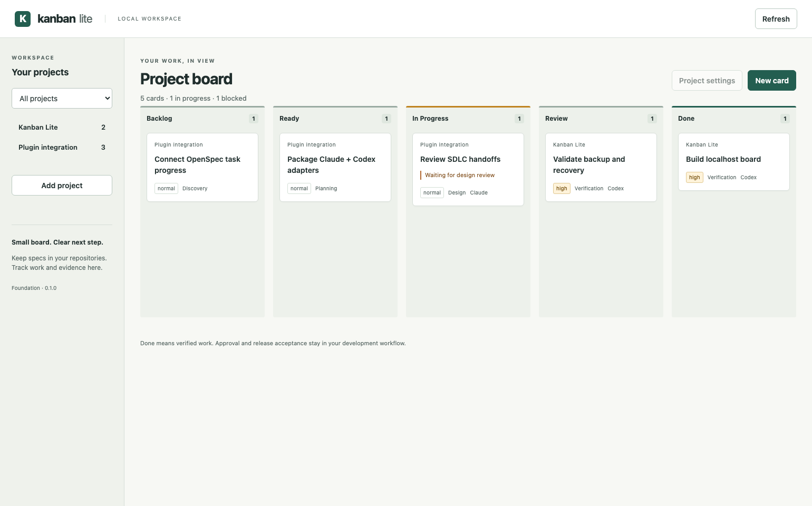

# Release 1 acceptance

Recorded on 2026-10-01. This evidence applies to the local foundation, not completed Claude Code/Codex or OpenSpec plugin integration.

## Behavior verified

- 28 Node tests cover persistence, transactional migrations, repository isolation and path containment, revisions, atomic activity history, verification rules, authenticated HTTP, one-writer startup, restart, live backup, and stopped-service restore.
- Four Chromium scenarios cover multi-project filtering, keyboard movement, owners/blockers/phase, WIP warnings, evidence and completion overrides, two-tab conflicts, stored HTML treated as text, and narrow-screen controls.
- Lint, type checks, and compilation pass locally. A separate clean checkout passed npm ci, all 28 Node tests, and all four Chromium scenarios. The initial GitHub CI run passed; corrected-head verification follows the review fixes.
- Desktop and narrow-screen screenshots were inspected for layout and usable controls. Preview data is illustrative, not a record of completed integrations.

[Narrow-screen preview](assets/board-mobile.png)

## Lightweight measurements

Measured with `npm run measure`: five fresh subprocesses, each with a new temporary data directory. Startup includes spawning Node and receiving a successful health response. Idle RSS is sampled 500 ms after startup and includes Node itself. Package measurements use `npm pack --dry-run`; they exclude the Node runtime and development dependencies.

Context reported by the acceptance environment: Node 24.21.0; darwin arm64; OS release 27.0.0; CPU identifier Apple M6.

| Metric                           | Observed value                   |
| -------------------------------- | -------------------------------- |
| Startup samples                  | 43.4, 59.7, 61.7, 60.9, 61.3 ms  |
| Median startup                   | 60.9 ms                          |
| Idle RSS samples                 | 62.4, 62.5, 62.4, 62.3, 62.3 MiB |
| Median idle RSS                  | 62.4 MiB                         |
| Compressed package               | 21,694 bytes                     |
| Unpacked package                 | 78,786 bytes                     |
| Third-party runtime dependencies | 0                                |

These are observations on one acceptance environment, not performance guarantees or browser-memory measurements. The board requires no Docker, hosted service, external database, or model API. It performs no idle polling or repository scanning.

## GitHub setup

GitHub Actions is enabled. Vulnerability alerts and automated security updates were verified enabled; security updates are not paused. Dependabot version updates are configured weekly for npm and GitHub Actions, with compatible development updates grouped and no auto-merge. The repository was initially empty with main configured. GitHub made feature/kanban-foundation the default when the approved feature branch was published first. Design-only main initialization remains pending user approval.

CI configuration covers lint, types, Node tests/build, dependency audit, and Chromium acceptance with immutable Action references. Initial feature CI passed on commit 9298cf8: https://github.com/alvintayzhenwei/kanban-lite/actions/runs/36884588054. Corrected-head CI is verified separately after review fixes. The README badge follows the actual default branch; no main-branch result is claimed.

## Remaining product acceptance

Release 2 must validate packages, MCP contracts, and actual tool discovery/shared state in both Claude Code and Codex. Release 3 must validate OpenSpec reconciliation and representative Agent Skills/Superpowers workflows. Source progress, workflow approval, verification, and release acceptance remain distinct.
